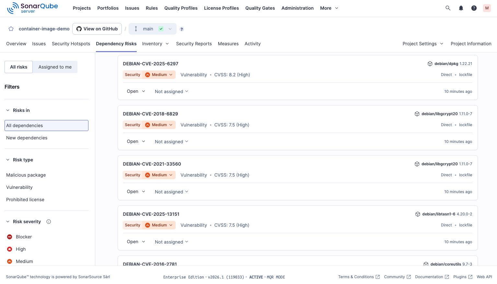

# SonarQube: SCA Scanning of Container Images via SBOM Import

Sonar allows to scan container image based on a provided SBOM of the image but does not directly connect to container registries (CR). This demo repo shows how to generate an SBOM for a container image (we use nginx as example) using Docker CLI, and then scan it with SonarQube to identify vulnerabilities.

Create the SBOM for the nginx image using Docker CLI, which under the hood uses Syft:

```
docker scout sbom --format cyclonedx --output nginx.cdx.json nginx
```

Then adjust the `sonar-project.properties` file to include the generated SBOM:

```
sonar.exclusions=**/*
sonar.sca.sbomImportPaths=nginx.cdx.json
sonar.inclusions=nginx.cdx.json
```

Then scanning via `sonar-scanner`:

```
sonar-scanner \
  -Dsonar.projectKey=e-corp-demo_container-image-demo_3a358296-7560-4757-89a9-13521728aa53 \
  -Dsonar.sources=. \
  -Dsonar.host.url=${SONARQUBE_URL} \
  -Dsonar.token=${SONARQUBE_TOKEN} \
  -Dsonar.verbose=true
```

Afterwards, you can view the vulnerabilities detected in the SonarQube dashboard.



## Questions & Contact

**Mathias Conradt**  
Security Solutions Engineer at Sonar  
https://www.linkedin.com/in/mathiasconradt/  
https://x.com/mathiasconradt